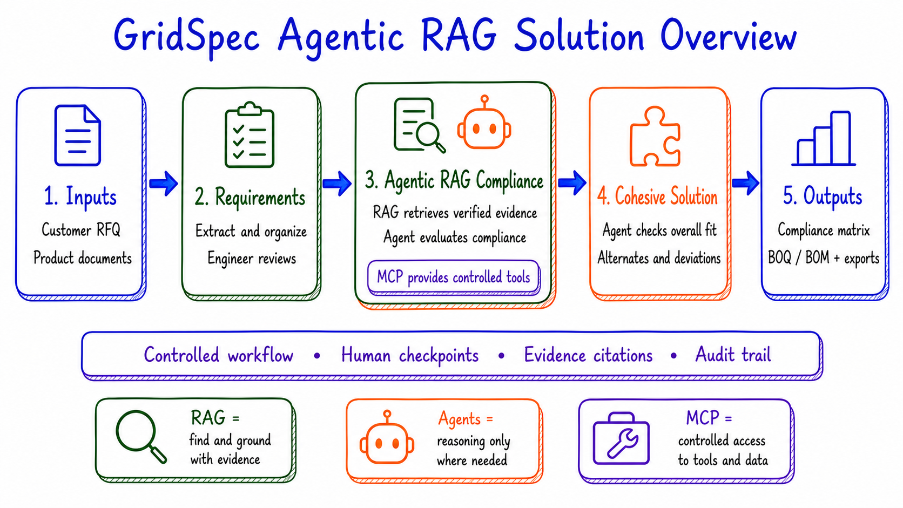
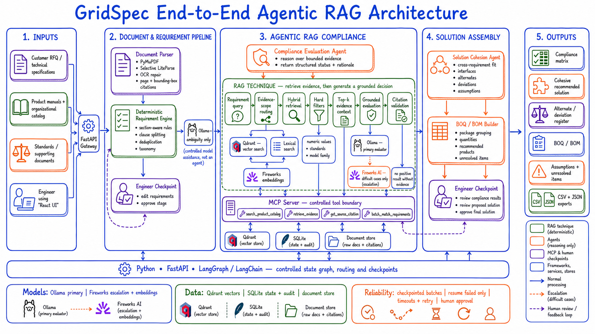
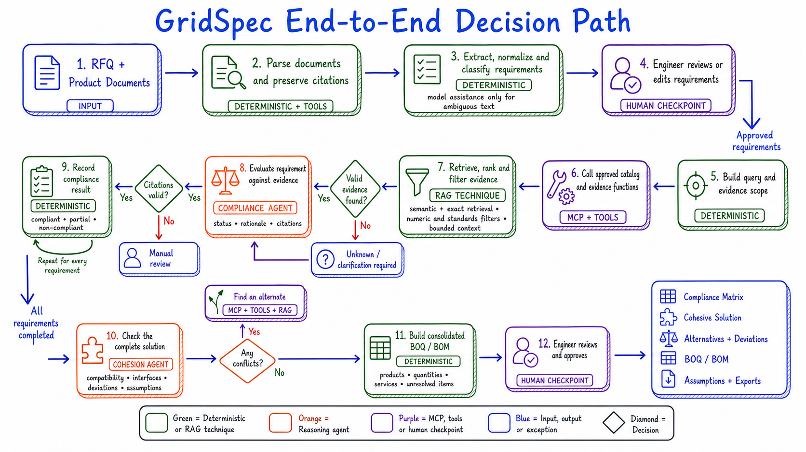
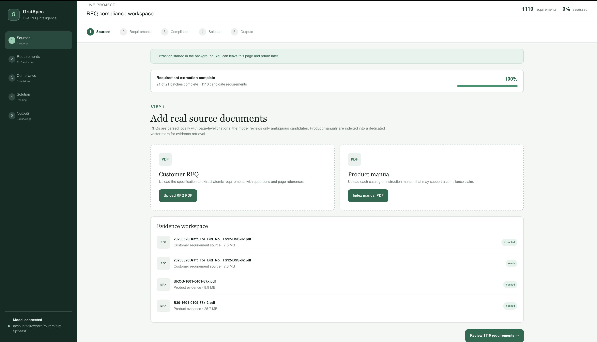
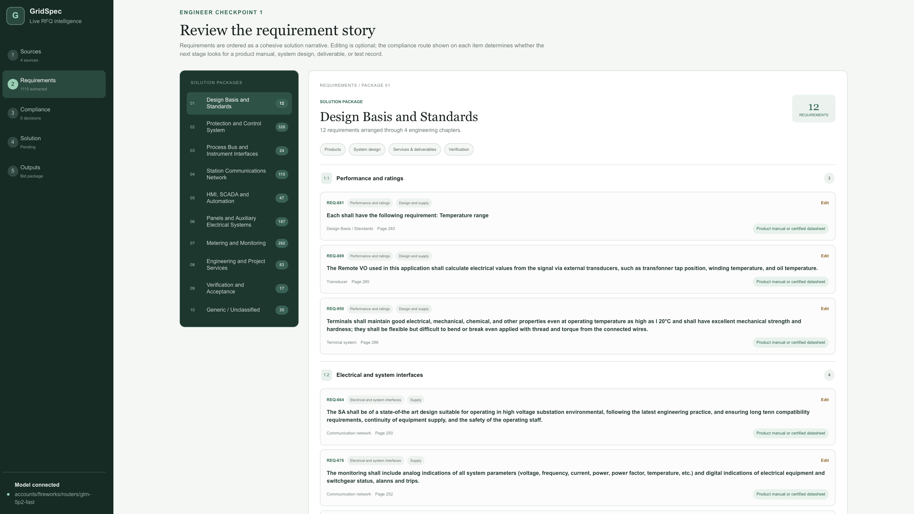
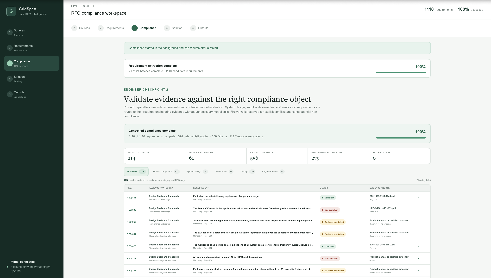
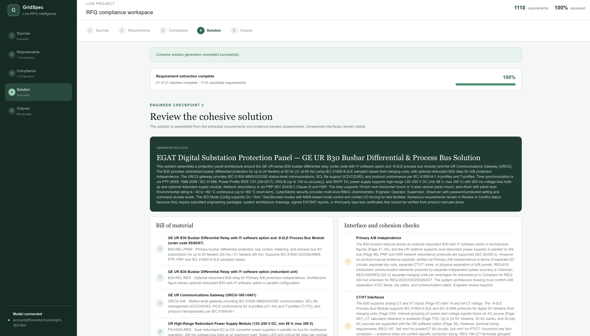
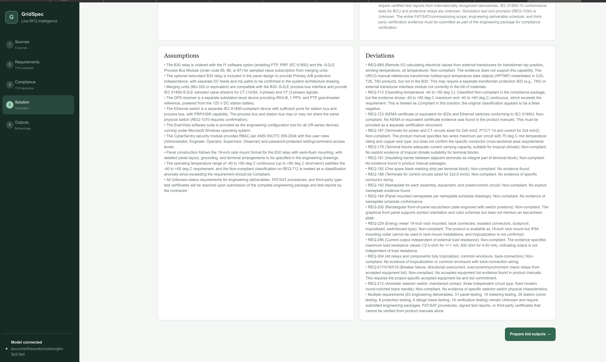
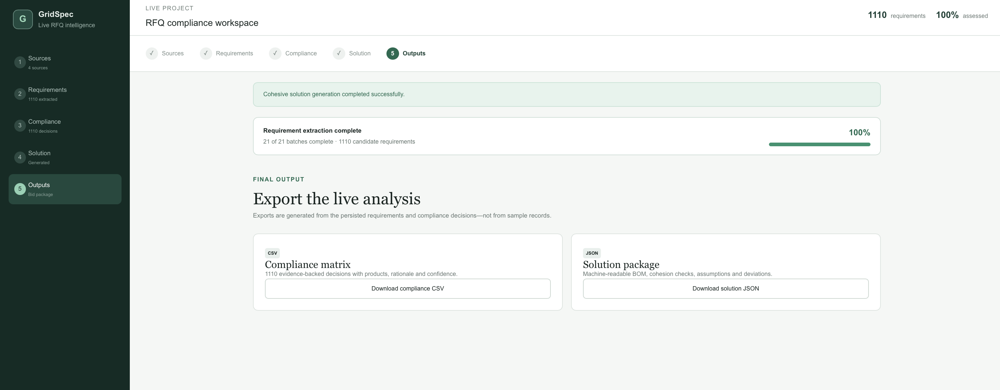

# GridSpec: Agentic RAG for RFQ Compliance

*GridSpec helps tendering and proposal teams review engineering RFQs, match technical requirements to product evidence, identify compliance gaps and deviation strategies, assemble a cohesive solution, and prepare a BOQ/BOM in a web application, replacing a manual document and catalog review that typically takes several days. It performs extraction, retrieval, matching, citation validation, compliance evaluation, alternative analysis, and draft solution assembly using four controlled MCP tools, hands off to engineers at the requirement and final solution checkpoints, and succeeds when a team can produce an initial bid draft in under one hour with 100% of compliance decisions either linked to verifiable evidence or explicitly routed for clarification.*

GridSpec is an engineer-controlled application that converts customer RFQs and product documentation into an evidence-backed compliance matrix, a cohesive technical solution, and a consolidated bill of quantities/materials (BOQ/BOM).

Unlike a free-running multi-agent system, GridSpec uses deterministic processing for predictable work, retrieval-augmented generation (RAG) for evidence grounding, and agents only for bounded engineering-reasoning tasks. Human checkpoints remain in the workflow before compliance analysis and final proposal outputs.

> **Project status:** Working prototype with real PDF processing, model connections, persisted workflow state, resumable extraction and compliance batches, and downloadable outputs. It is an engineering decision-support tool and does not replace qualified technical review.

## Contents

- [Problem statement](#problem-statement)
- [Solution overview](#solution-overview)
- [Key capabilities](#key-capabilities)
- [Architecture overview](#architecture-overview)
- [Decision path](#decision-path)
- [Application workflow](#application-workflow)
- [Application screenshots](#application-screenshots)
- [Technology stack](#technology-stack)
- [Project structure](#project-structure)
- [Getting started](#getting-started)
- [Configuration](#configuration)
- [API and MCP interfaces](#api-and-mcp-interfaces)
- [Testing and quality checks](#testing-and-quality-checks)
- [Security and data handling](#security-and-data-handling)
- [Current limitations](#current-limitations)
- [Troubleshooting](#troubleshooting)
- [Responsible use](#responsible-use)
- [License](#license)

## Problem statement

Responding to complex engineering RFQs is slow and difficult to audit. A typical proposal team must:

- locate hundreds of technical obligations across long and inconsistently formatted documents;
- normalize, categorize, and deduplicate requirements without losing the original source wording;
- identify which product, system-design, service, test, or deliverable evidence is appropriate for each requirement;
- compare requirements with product manuals while preserving exact page-level citations;
- distinguish compliant, partially compliant, non-compliant, conditional, and unresolved items;
- propose alternatives where the preferred product does not satisfy the requirement;
- ensure individually selected products form a compatible overall solution; and
- consolidate the result into a compliance matrix and BOQ/BOM.

Manual execution is time-consuming and inconsistent. A conventional LLM-only workflow is faster, but it can omit requirements, confuse similar products, overlook numeric mismatches, or make claims without verifiable evidence.

GridSpec addresses this with a controlled pipeline in which rules handle repeatable processing, RAG supplies bounded product evidence, agents perform narrowly scoped reasoning, and engineers approve major stages.

## Solution overview



The end-to-end flow has five major stages:

1. **Inputs:** Upload a customer RFQ and one or more product manuals.
2. **Requirements:** Parse the RFQ, extract atomic obligations, organize them into an engineering taxonomy, and allow an engineer to edit the result.
3. **Agentic RAG compliance:** Retrieve product evidence through controlled MCP tools, apply lexical/vector/numeric/standards gates, and evaluate compliance against a bounded evidence set.
4. **Cohesive solution:** Check cross-requirement compatibility, interfaces, alternatives, deviations, and assumptions.
5. **Outputs:** Produce the compliance matrix, solution package, BOQ/BOM, assumptions, deviations, and machine-readable exports.

### Design principles

- **Deterministic first:** rules, filters, validation, persistence, and aggregation are implemented in code.
- **Evidence before reasoning:** product compliance is evaluated only after relevant manual evidence has been retrieved.
- **Agents only where necessary:** agents are limited to ambiguous interpretation, grounded compliance reasoning, and solution-cohesion analysis.
- **No unsupported positive claims:** a positive product-compliance decision requires validated source evidence.
- **Human-in-the-loop:** requirements and the assembled solution are exposed for engineering review.
- **Resumable by design:** long extraction and compliance runs are checkpointed and can resume incomplete work after interruption.

## Key capabilities

- Real PDF upload and page-aware parsing with PyMuPDF
- Selective complex-layout processing with LiteParse
- Exact source quotations, page numbers, and bounding-box metadata
- Deterministic obligation detection and section-context filtering
- Clause reassembly, normalized wording, and numeric/standards-aware deduplication
- Engineering taxonomy across products, system design, services, testing, and deliverables
- Editable requirement register with an engineer checkpoint
- Product-manual chunking, embedding, and local Qdrant vector indexing
- Hybrid semantic and lexical evidence matching
- Deterministic pre-match gates for weak, numerically inconsistent, or wrong-product evidence
- Ollama-first compliance evaluation with selective Fireworks escalation
- Citation and evidence-quote validation
- Checkpointed compliance batches with resume and re-evaluate controls
- Cross-requirement cohesion checks and alternative/deviation handling
- CSV compliance export and JSON solution export
- Persisted job state and audit-oriented metadata in SQLite

## Architecture overview



The architecture separates five concerns:

1. **User experience:** A React interface guides the engineer through Sources, Requirements, Compliance, Solution, and Outputs.
2. **Controlled orchestration:** FastAPI exposes the application API, while LangGraph coordinates extraction, compliance, and solution-generation state transitions.
3. **Document and requirement processing:** Local parsers preserve source traceability; deterministic candidate and taxonomy logic handles predictable transformations; model assistance is reserved for ambiguous candidates.
4. **Agentic RAG compliance:** The workflow creates an evidence-scoped query, retrieves product-manual chunks through MCP, applies deterministic gates, evaluates the bounded evidence, and validates the returned citations.
5. **Persistence and recovery:** SQLite stores documents, requirements, assessments, solutions, jobs, and batch checkpoints. Qdrant stores product-manual vectors and metadata.

### Controlled model routing

- **Ollama** is the first-choice local model for ambiguous requirement candidates and evidence-qualified compliance evaluations.
- **Fireworks AI** provides embeddings and acts as the hosted fallback/escalation path for low-confidence, conflicting, or consequential reasoning cases.
- Provider failures and low-confidence outcomes are persisted conservatively rather than converted into unsupported compliance claims.

### RAG is a technique, not an agent

The RAG path performs query construction, evidence-scope routing, retrieval, deterministic filtering, context bounding, grounded evaluation, and citation validation. Qdrant is the vector store used by the retrieval layer; it is not the compliance decision engine.

### MCP is the tool boundary, not an agent

The Product Catalog MCP server exposes a small set of approved catalog operations. It prevents reasoning nodes from receiving unrestricted access to application storage or product documents and returns structured, source-aware evidence.

## Decision path



For every requirement, the pipeline:

1. determines the correct evidence scope;
2. calls approved MCP catalog functions;
3. retrieves, ranks, and filters candidate evidence;
4. returns `Unknown` or requests clarification when sufficient evidence is unavailable;
5. invokes the compliance agent only with bounded, evidence-qualified context;
6. validates citations before persisting the decision;
7. repeats for all requirements;
8. checks solution-level compatibility and searches for alternatives when conflicts remain; and
9. builds the BOQ/BOM and final proposal outputs for engineer review.

## Application workflow

### 1. Sources

Upload at least one product manual and one customer RFQ. Product manuals are parsed, chunked, embedded, and indexed through the Product Catalog MCP service. RFQs are stored as requirement sources.

### 2. Requirements

Start controlled extraction for the RFQ. Review the resulting requirement story by solution package and engineering subcategory. Requirement editing is optional; the complete stage can proceed without approving items individually.

### 3. Compliance

Start the checkpointed compliance run. Results are organized into product compliance, system design, deliverables, testing, and engineer-review lanes. Failed or interrupted batches can be resumed without repeating completed batches. A completed run can be re-evaluated after source or requirement changes.

### 4. Solution

Generate and review the cohesive solution. The application presents the recommended BOM, interface/cohesion checks, assumptions, and deviations together rather than treating each requirement as an isolated product match.

### 5. Outputs

Download the compliance matrix as CSV and the structured solution package as JSON.

## Application screenshots

The screenshots below show a completed workflow using a real RFQ and indexed product manuals. In this run, GridSpec extracted and evaluated 1,110 requirements.

### Sources

The Sources workspace accepts RFQ and product-manual PDFs, shows parsing/indexing state, and reports resumable extraction progress.



### Requirements

The Requirements workspace presents a cohesive engineering story organized by solution package and subcategory. Each requirement retains its RFQ page reference, expected evidence route, and an optional edit action.



### Compliance

The Compliance workspace summarizes decisions, exceptions, unresolved evidence, engineering deliverables, and batch health. Results can be filtered by evidence lane and expanded to inspect the supporting source.



### Solution

The Solution workspace assembles the recommended configuration and presents the consolidated BOM beside cross-requirement interface and cohesion checks.



The same solution preserves assumptions and deviations as explicit proposal artifacts instead of hiding unresolved engineering decisions.



### Outputs

The Outputs workspace generates a CSV compliance matrix and a machine-readable JSON solution package from persisted live results.



## Technology stack

| Layer | Technology | Responsibility |
| --- | --- | --- |
| Web UI | React 19, TypeScript, Vinext/Next-compatible App Router, Vite | Five-stage engineer workspace, progress, editing, review, and exports |
| API | Python, FastAPI, Uvicorn | Uploads, workflow endpoints, status, persistence access, and background-job control |
| Workflow | LangGraph, LangChain | Controlled extraction, compliance, and cohesive-solution graphs |
| PDF processing | PyMuPDF, LiteParse | Canonical page/layout extraction and selective complex-page processing |
| Local reasoning | Ollama | Ambiguous-candidate interpretation and primary compliance evaluation |
| Hosted AI | Fireworks AI | Embeddings, fallback reasoning, and selective escalation |
| Tool protocol | Model Context Protocol (MCP) | Controlled product-catalog indexing and retrieval interface |
| Vector retrieval | Qdrant local mode | Product-manual embeddings, evidence text, and source metadata |
| Operational storage | SQLite | Documents, requirements, assessments, solutions, jobs, batches, and checkpoints |
| Validation | Pydantic | Structured agent and API outputs |
| Package management | npm, uv | Frontend and Python dependency management |
| Tests and linting | Pytest, Ruff, ESLint | Backend behavior, formatting/lint checks, and frontend static checks |

## Project structure

```text
rfp-compliance/
├── app/
│   ├── page.tsx                  # Five-stage React workspace
│   ├── layout.tsx                # Application metadata and root layout
│   ├── globals.css               # Primary application styling
│   └── cohesive.css              # Cohesive requirement/compliance views
├── backend/
│   ├── app/
│   │   ├── main.py               # FastAPI routes and background-job lifecycle
│   │   ├── graphs.py             # LangGraph workflows
│   │   ├── agents.py             # Structured model calls and solution reasoning
│   │   ├── candidates.py         # Deterministic requirement candidates
│   │   ├── taxonomy.py           # Engineering classification and evidence scope
│   │   ├── pdf.py                # PDF parsing, layout, chunks, and citations
│   │   ├── extraction_jobs.py    # Checkpointed extraction jobs
│   │   ├── compliance_jobs.py    # Controlled compliance and resume logic
│   │   ├── mcp_client.py         # MCP client wrapper
│   │   ├── db.py                 # SQLite schema and persistence
│   │   ├── models.py             # Pydantic and workflow-state models
│   │   └── config.py             # Environment-backed configuration
│   ├── catalog_mcp/
│   │   └── server.py             # Product Catalog MCP server and Qdrant access
│   ├── tests/                     # API, extraction, taxonomy, compliance, and solution tests
│   ├── pyproject.toml             # Python project and dependencies
│   ├── uv.lock                    # Locked Python dependency graph
│   ├── .env.example               # Backend configuration template
│   └── run_api.py                 # Uvicorn entry point
├── docs/images/                   # README diagrams and application screenshots
├── public/                        # Static web assets
├── run-demo.sh                    # Starts MCP, API, optional Ollama, and UI
├── package.json                   # Frontend scripts and dependencies
└── .env.example                   # Optional frontend API URL override
```

Runtime data is created under `backend/data/` and is intentionally excluded from version control.

## Getting started

### Prerequisites

- Node.js **22.13 or newer**
- Python **3.11 to 3.13**
- [`uv`](https://docs.astral.sh/uv/) for Python environment management
- A Fireworks AI API key
- Optional: [Ollama](https://ollama.com/) with `llama3.1:8b` for local-first candidate and compliance evaluation

### 1. Install or prepare the local model (optional)

```bash
ollama pull llama3.1:8b
```

If Ollama is installed but not running, `run-demo.sh` attempts to start it. If it is unavailable, the controlled workflow uses the configured Fireworks fallback where supported.

### 2. Configure the backend

```bash
cd backend
cp .env.example .env
```

Open `backend/.env` and set:

```dotenv
FIREWORKS_API_KEY=fw_your_key_here
```

Do not commit `backend/.env` or expose the API key in screenshots, logs, or issues.

### 3. Start the complete application

From the repository root:

```bash
chmod +x run-demo.sh
./run-demo.sh
```

The default endpoints are:

- UI: `http://localhost:3000`
- API documentation: `http://127.0.0.1:8000/docs`
- MCP endpoint: `http://127.0.0.1:8001/mcp`

If the default UI port is occupied, the development server may select the next available port; use the URL printed in the terminal.

### Start services separately

Use separate terminals when debugging individual layers.

**Terminal 1: Product Catalog MCP**

```bash
cd backend
uv sync
uv run python -m catalog_mcp.server
```

**Terminal 2: FastAPI**

```bash
cd backend
uv run python run_api.py
```

**Terminal 3: React UI**

```bash
npm install
npm run dev
```

## Configuration

The main backend settings are defined in `backend/.env.example`.

| Variable | Purpose | Default/example |
| --- | --- | --- |
| `FIREWORKS_API_KEY` | Fireworks authentication | Required |
| `FIREWORKS_CHAT_MODEL` | Default hosted reasoning model | Fireworks router identifier |
| `FIREWORKS_STRONG_MODEL` | Escalation model | Fireworks model identifier |
| `FIREWORKS_EMBEDDING_MODEL` | Product-evidence embedding model | `fireworks/qwen3-embedding-8b` |
| `OLLAMA_BASE_URL` | Local Ollama endpoint | `http://127.0.0.1:11434` |
| `OLLAMA_CANDIDATE_MODEL` | Ambiguous extraction candidate model | `llama3.1:8b` |
| `OLLAMA_COMPLIANCE_MODEL` | Primary local compliance model | `llama3.1:8b` |
| `COMPLIANCE_RETRIEVAL_LIMIT` | Candidate evidence retrieved per requirement | `10` |
| `COMPLIANCE_EVIDENCE_LIMIT` | Evidence items passed to evaluation | `4` |
| `COMPLIANCE_VECTOR_THRESHOLD` | Minimum vector relevance threshold | `0.52` |
| `COMPLIANCE_LEXICAL_THRESHOLD` | Minimum lexical overlap threshold | `0.16` |
| `MCP_SERVER_URL` | Catalog MCP endpoint | `http://127.0.0.1:8001/mcp` |
| `DATABASE_PATH` | SQLite path relative to `backend/` | `data/gridspec.db` |
| `UPLOAD_DIR` | Uploaded PDF directory | `data/uploads` |
| `QDRANT_PATH` | Local Qdrant storage | `data/qdrant` |
| `API_PORT` / `MCP_PORT` | Local service ports | `8000` / `8001` |

The optional root `.env.example` configures `NEXT_PUBLIC_PIPELINE_API_URL` when the API is not running at its default local address.

## API and MCP interfaces

### Key API routes

| Method | Route | Purpose |
| --- | --- | --- |
| `GET` | `/health` | API health check |
| `GET` | `/status` | Model, extraction, MCP, and index readiness |
| `GET` / `POST` | `/documents` | List or upload RFQ/product PDFs |
| `POST` | `/extract` | Start or force a requirement extraction job |
| `GET` | `/extractions/latest` | Read the latest extraction job |
| `GET` / `PATCH` | `/requirements` | List or edit normalized requirements |
| `GET` / `POST` | `/compliance` | Read results or start/resume compliance |
| `GET` | `/compliance/jobs/latest` | Read checkpointed compliance progress |
| `GET` / `POST` | `/solution` | Read or generate the cohesive solution |

Interactive API documentation is available from the running backend at `/docs`.

### Product Catalog MCP tools

| Tool | Purpose |
| --- | --- |
| `index_product_manual` | Embed and index page-aware product-manual chunks |
| `search_manual_evidence` | Retrieve source-aware evidence for one query |
| `search_manual_evidence_batch` | Retrieve evidence for a checkpoint batch |
| `catalog_status` | Return catalog readiness and indexed-chunk count |

## Testing and quality checks

### Backend

```bash
cd backend
uv sync --extra dev
uv run pytest
uv run ruff check .
```

The test suite covers API behavior, taxonomy, extraction jobs and resilience, compliance checkpoints, and bounded solution context.

### Frontend

```bash
npm install
npm run lint
npm run build
```

## Security and data handling

- Environment files and backend runtime data are excluded from version control.
- Never commit Fireworks keys, uploaded customer RFQs, proprietary manuals, SQLite files, or Qdrant data.
- The MCP server binds locally and exposes only approved catalog operations.
- Uploaded PDFs are sanitized to safe local filenames before storage.
- Model-produced evidence is accepted only when the quoted text is found in retrieved source content.
- CORS is currently configured for local development ports and should be restricted for deployment.
- Add authentication, authorization, encrypted storage, secret management, and retention policies before multi-user or production deployment.

## Current limitations

- Only PDF source documents are currently supported.
- OCR and complex-layout quality depend on the source document; scanned or highly graphical specifications may require manual review.
- Compliance quality is limited by the completeness and correctness of the uploaded product evidence.
- `Unknown` and engineer-review outcomes are expected when the available documents cannot prove a claim.
- SQLite and local Qdrant are appropriate for a prototype or single-node workflow, not a horizontally scaled deployment.
- The BOQ/BOM is a proposal aid and requires engineering and commercial validation before submission.
- No authentication or role-based access control is implemented in the local demo.

## Troubleshooting

### `FIREWORKS_API_KEY is missing`

Copy `backend/.env.example` to `backend/.env`, add the key, and restart all services.

### Ollama is unavailable

Run `ollama serve` and confirm that `llama3.1:8b` is installed. The application can use the configured hosted fallback, but this may increase API usage.

### The UI cannot reach the API

Confirm that `http://127.0.0.1:8000/health` returns `{"status":"ok"}` and that `NEXT_PUBLIC_PIPELINE_API_URL` points to the same API origin.

### A compliance run was interrupted

Restart the API and use **Resume failed batches**. Completed checkpoints are retained; the pipeline does not need to repeat successful batches.

### Most product results are `Unknown`

Confirm that the relevant product manuals are indexed, then inspect the evidence scope, numeric/standards requirements, and vector/lexical thresholds. The system intentionally avoids positive decisions when evidence is missing or unverifiable.

### Port already in use

Stop the conflicting process or use the alternate UI URL printed by the development server. The API and MCP ports can be changed in `backend/.env`.

## Responsible use

GridSpec is intended to accelerate engineering review, not replace it. Every proposal should be reviewed by qualified protection, control, panel, application, and commercial engineers before being issued to a customer.

## License

GridSpec is source-available under the [PolyForm Noncommercial License 1.0.0](LICENSE.md).

You may use, study, modify, and redistribute the software only for permitted noncommercial purposes. Commercial use of the original software, a modified version, a derivative work, or a product or service based on this solution is not licensed. Contact the repository owner to request a separate commercial license.

This summary is provided for convenience. The terms in `LICENSE.md` govern.
